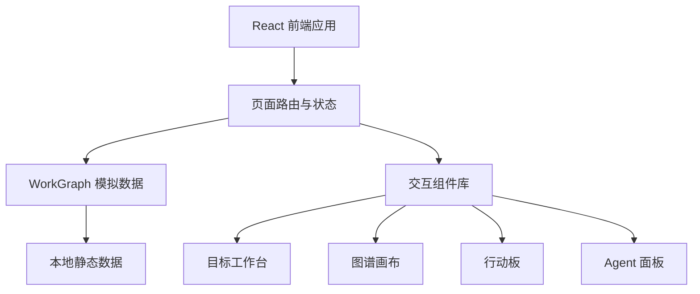
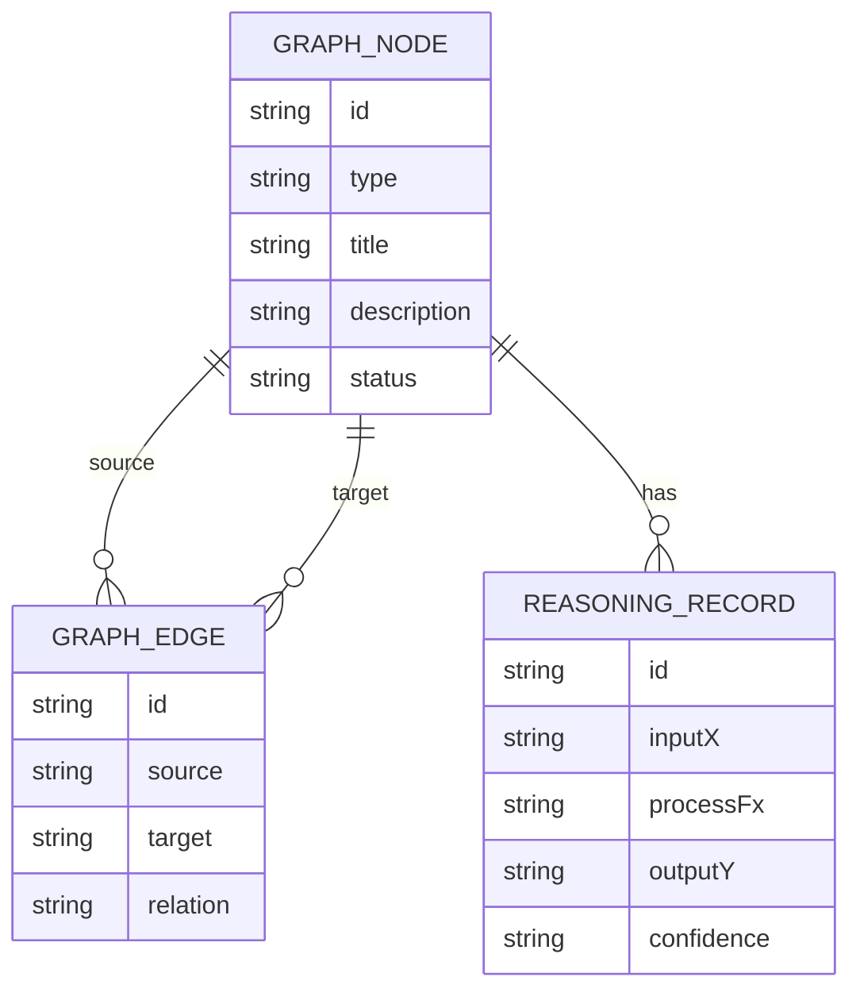

## 1. 架构设计



## 2. 技术描述
- 前端：React@18 + TypeScript + Vite
- 样式：Tailwind CSS@3 + 自定义 CSS 变量
- 路由：React Router
- 图标：lucide-react
- 动画：CSS transition + 少量 Framer Motion（如已安装可使用，否则使用 CSS）
- 后端：无，MVP 使用本地 mock 数据
- 数据：静态 TypeScript 数据模型，后续可替换为图数据库或 API

## 3. 路由定义
| 路由 | 用途 |
|------|------|
| `/` | 目标入口页 |
| `/understanding` | 目标理解工作台 |
| `/sub-goals` | 小目标拆解页 |
| `/graph` | 工作图谱视图 |
| `/actions` | 行动板 |

## 4. API 定义
MVP 无后端 API，使用本地数据结构模拟：

```ts
type GraphNodeType =
  | 'raw_intent'
  | 'goal'
  | 'assumption'
  | 'constraint'
  | 'sub_goal'
  | 'task'
  | 'evidence'
  | 'exception'
  | 'reasoning_record'

interface GraphNode {
  id: string
  type: GraphNodeType
  title: string
  description: string
  status?: string
  confidence?: 'low' | 'medium' | 'high'
}

interface GraphEdge {
  id: string
  source: string
  target: string
  relation: 'derives_from' | 'supports' | 'depends_on' | 'proves' | 'impacts' | 'approves'
}

interface ReasoningRecord {
  id: string
  inputX: string[]
  processFx: string[]
  outputY: string[]
  confidence: 'low' | 'medium' | 'high'
}
```

## 5. 服务端架构图
MVP 无服务端。

## 6. 数据模型

### 6.1 数据模型定义



### 6.2 数据定义语言
MVP 不需要数据库 DDL。
