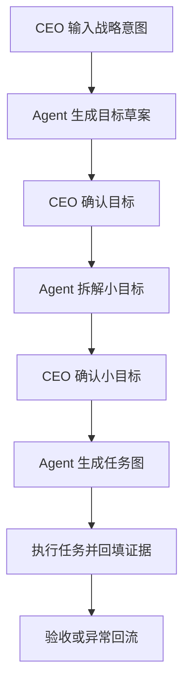

## 1. 产品概述
WorkGraph Web Demo 是一个面向 CEO 与 Agent 协作的可推理办公原型，把“文档产物”替换为“可推理工作图谱”。
- 主要解决战略目标从自然语言到目标、小目标、任务、证据、复盘的断裂问题。
- MVP 价值是让用户直观看到人类负责确认与承诺，Agent 负责拆解、执行和回填证据。

## 2. 核心功能

### 2.1 用户角色
| 角色 | 进入方式 | 核心权限 |
|------|----------|----------|
| CEO / 决策者 | Demo 默认角色 | 输入目标、确认目标、确认小目标、处理重大偏差 |
| 目标负责人 | Demo 内置角色 | 查看目标、调整拆解、推进任务、处理阻塞 |
| Agent | Demo 内置模拟角色 | 生成候选变更、拆解任务、回填证据、记录推理 |

### 2.2 功能模块
1. **目标入口页**：输入战略意图、选择 Agent、创建原始意图节点。
2. **目标理解工作台**：展示目标草案、假设、约束、待确认问题、Agent 候选变更。
3. **小目标拆解页**：展示小目标树、支撑逻辑、风险和确认门。
4. **工作图谱视图**：展示目标、假设、小目标、任务、证据、异常、推理记录的关系。
5. **行动板**：展示任务状态、依赖、证据要求、Agent 执行面板。

### 2.3 页面详情
| 页面名称 | 模块名称 | 功能描述 |
|----------|----------|----------|
| 目标入口页 | 原始意图输入 | 输入“我们要在东南亚市场拿下 1 亿营业额”等目标 |
| 目标入口页 | Agent 推荐 | 展示市场、销售、财务、法务 Agent |
| 目标理解工作台 | 目标草案 | 展示指标、目标值、范围、周期、成功标准 |
| 目标理解工作台 | 推理记录抽屉 | 展示 `f(x)`，说明输入信息、推理过程和阶段结论 |
| 小目标拆解页 | 小目标树 | 展示印尼主战场、泰国渠道试点、越南本地化等拆解 |
| 工作图谱视图 | 图谱画布 | 以节点和连线展示工作图谱 |
| 行动板 | 任务看板 | 展示待办、进行中、阻塞、完成 |

## 3. 核心流程
用户先输入战略意图，Agent 将其转成目标草案和澄清问题；CEO 确认后，Agent 拆解小目标；再次确认后生成任务图；执行过程中回填证据；出现重大偏差时回流决策层。

## 4. 用户界面设计

### 4.1 设计风格
- 主色：深墨蓝、骨白、冷青绿，突出“经营指挥舱”和“推理图谱”质感。
- 辅色：风险橙、确认绿、证据蓝，用于状态表达。
- 按钮：几何圆角、细边框、轻玻璃质感，强调专业和可信。
- 字体：中文优先使用系统可用的宋黑搭配，标题偏杂志化，正文偏工程化。
- 布局：桌面优先三栏工作台，左侧目标导航，中间主工作区，右侧 Agent 与推理记录。

### 4.2 页面设计概览
| 页面名称 | 模块名称 | UI 元素 |
|----------|----------|---------|
| 目标入口页 | Hero 输入区 | 大输入框、Agent 筹码、目标模板、开始按钮 |
| 目标理解工作台 | 草案表单 | 字段卡片、假设表、约束表、待确认问题 |
| 小目标拆解页 | 小目标树 | 树形结构、支撑逻辑卡、风险标记 |
| 工作图谱视图 | 图谱画布 | 节点、关系线、图例、节点详情 |
| 行动板 | 任务看板 | Kanban、依赖线、证据状态、执行按钮 |

### 4.3 响应式
桌面优先，适配 1440px 以上工作台体验；窄屏时右侧 Agent 面板折叠为抽屉，左侧目标导航收起为图标栏。
